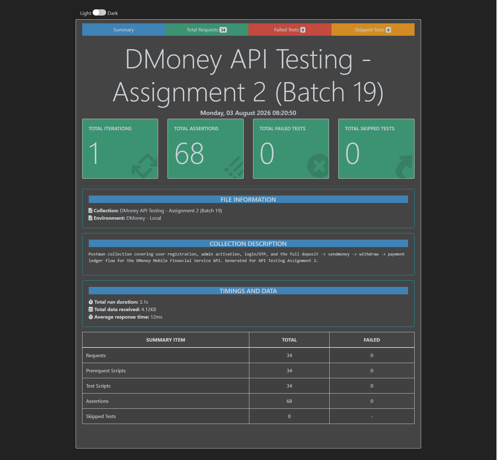

# DMoney API Testing — Assignment 2 (Batch 19)

Postman/Newman API test suite for the **DMoney** Mobile Financial Service backend, covering the required flow end-to-end:

> Register 2 Customers + 1 Agent + 1 Merchant → Admin activates all four → SYSTEM deposits 5000 tk to the Agent → Agent deposits 2000 tk to Customer1 (deposit **commission** asserted) → Customer1 sends 1000 tk to Customer2 (**service fee** asserted) → Customer2 cashes out 500 tk from the Agent (**service fee** asserted) → Customer2 pays 400 tk to the Merchant.

- **Test cases (30, positive + negative):** [docs/Test-Cases.md](docs/Test-Cases.md)
- **API documentation:** [docs/API-Documentation.md](docs/API-Documentation.md)
- **Postman collection:** [postman/DMoney-API-Testing.postman_collection.json](postman/DMoney-API-Testing.postman_collection.json)
- **Postman environment:** [postman/DMoney-Local.postman_environment.json](postman/DMoney-Local.postman_environment.json)

## Newman report

Latest run: **34/34 requests passed, 68/68 assertions passed, 0 failed.**



(The full interactive HTML report is regenerated locally at `reports/newman-report.html` by `npm test` — that folder is git-ignored per the submission requirements, so only this summary screenshot is committed.)

## What this collection does

| Folder | Covers |
|---|---|
| `01 - User Registration` | Registers Customer1, Customer2, Agent, Merchant (+ negative cases: duplicate email, invalid role, non-Gmail email) |
| `02 - Admin Login & User Activation` | Admin login, activates all 4 accounts |
| `03 - Login & OTP Verification` | Agent/Customer1/Customer2/Merchant login + OTP verification (+ negative: wrong password, wrong OTP, non-admin trying to activate another user's account) |
| `04 - Transactions` | SYSTEM → Agent deposit (5000 tk), Agent → Customer1 deposit (2000 tk, asserts 50 tk commission), Customer1 → Customer2 SendMoney (1000 tk, asserts 5 tk fee), Customer2 → Agent Withdraw/Cashout (500 tk, asserts 5 tk fee), Customer2 → Merchant Payment (400 tk, asserts 5 tk fee), plus negative cases (wrong account roles, missing auth headers) |

Full test-case-by-test-case breakdown with expected results: [docs/Test-Cases.md](docs/Test-Cases.md).

## Prerequisites

1. The `dmoney-transaction-api` backend running locally (default `http://localhost:5000`), with MySQL migrated and seeded (`Commissions` and `TransactionLimits` tables must be populated — see that repo's `migrations/` scripts).
2. In the backend's `.env`, add a dev-only OTP bypass so this collection can log in as Agent/Customer/Merchant without reading OTPs from the server console/email:
   ```
   DEFAULT_OTP=0000
   ```
   The `/user/verify-otp` endpoint accepts `?env=dev` with `otp` equal to this value and skips the real OTP match/expiry check (see `controllers/users/user.controller.js`). **This is a local/dev-only convenience — never set this in a production `.env`.**
3. Node.js installed (for running Newman).

## How to run

```bash
npm install
npm test
```

`npm test` runs the collection with Newman against the `DMoney - Local` environment and writes an HTML report to `reports/newman-report.html`.

Or, run everything by hand:
```bash
npx newman run postman/DMoney-API-Testing.postman_collection.json \
  -e postman/DMoney-Local.postman_environment.json \
  --reporters cli,htmlextra \
  --reporter-htmlextra-export reports/newman-report.html
```

Or import both JSON files into the Postman app and use **Collection Runner**.

### Re-runnable by design
A collection-level pre-request script generates a unique timestamp-based suffix once per run and derives unique phone numbers/emails for all 4 test users from it — so the same collection can be run repeatedly against the same database without "user already exists" collisions.

## Project structure

```
dmoney-postman-api-testing/
├── postman/
│   ├── DMoney-API-Testing.postman_collection.json
│   └── DMoney-Local.postman_environment.json
├── docs/
│   ├── Test-Cases.md
│   ├── API-Documentation.md
│   └── newman-report-screenshot.png
├── scripts/
│   └── generate-collection.js      # regenerates the collection/environment JSON
├── reports/                        # newman HTML/JSON output (git-ignored)
├── package.json
└── .gitignore                      # node_modules/, reports/, .env
```

## Fee/commission rules asserted by this suite

| Transaction type | Rule | Example in this suite |
|---|---|---|
| Deposit | Agent earns 2.5% commission | 2000 tk deposit → 50 tk commission |
| SendMoney | Flat 5 tk system fee | 1000 tk transfer → 5 tk fee |
| Withdraw | 1% system fee, 5 tk minimum | 500 tk withdraw → 5 tk fee |
| Payment | 1% system fee, 5 tk minimum | 400 tk payment → 5 tk fee (1% of 400 = 4, floored to 5) |

Rates are DB-driven (`Commissions` table), not hardcoded — see the backend's `migrations/create_commission_table.js` for the seeded values these assertions are based on.
